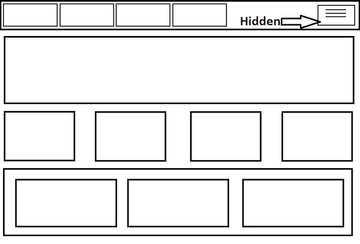

# Responsive Boxes

In this exercise we are going to practice restyling a website that has been designed for desktop. Our aim is to make the site responsive so that it will look presentable on screens of all sizes.

### Procedure

Before you begin, it is important to remember that you **should not** modify your `index.html`. All the alterations to the layout as you change screen size will result from responsive CSS.

1. The HTML has already been created for you, as well as a CSS file called `boxing_1.css`. This file defines css rules for the desktop layout of the site. View the page in the browser and take a few minutes to digest the CSS in the file and how it results in the graphical representation you are seeing. 

2. Create a new CSS file called `boxing_2.css`. In this file, you will define css rules to create the mobile layout  of this site. You will **not** use media queries in this file. Instead, you will create a mobile layout that will apply to the site regardless of scree size. Hint: much of the css in this file will be the same as in `boxing_1.css`. I would recommend copying the contents of that file and using that as your starting place. 

3. Now that you have an idea of what CSS is needed for the large screen layout, and what CSS is needed for the
small screen layout, create a new file called `boxing_media_query.css`. This file will use a media query to check if the screen size is less than or equal to 768px. If so, you want to use styles for the small screen layout, and if not, you want to use styles for the large screen layout. It is important to remember here that **most of the CSS will be the same regardless of what size the screen is**. You will only need to include a few CSS rules in the media query itself.   
